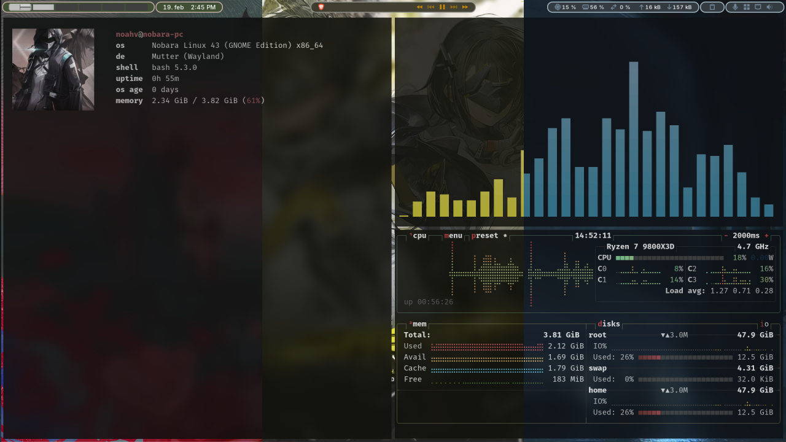

# Custom Linux Terminal Dashboard

A simple way to launch a beautiful 3-window terminal dashboard on startup. This setup is designed for Tiling Window Managers (or GNOME extensions like Tiling Assistant/Pop Shell) to achieve a "Master-Stack" layout with distinct window gaps and blur effects.

## Prerequisites

- **WezTerm**: The terminal emulator used in this setup.
- **Tiling Environment**: Works best with GNOME Tiling extensions or a Tiling Window Manager.
- **Applications**: 
  - `cava` (Audio visualizer)
  - `btop` (System monitor)
  - A custom fetch script (like `fastfetch`)

## Installation

### 1. The Startup Script
The `start_my_terminals.sh` script handles the logic of opening windows with delays to ensure the tiling manager places them correctly.

1. Download `start_my_terminals.sh` to `~/.local/bin/`.
2. **IMPORTANT:** Open the files and replace `USERNAME` with your actual Linux username:
